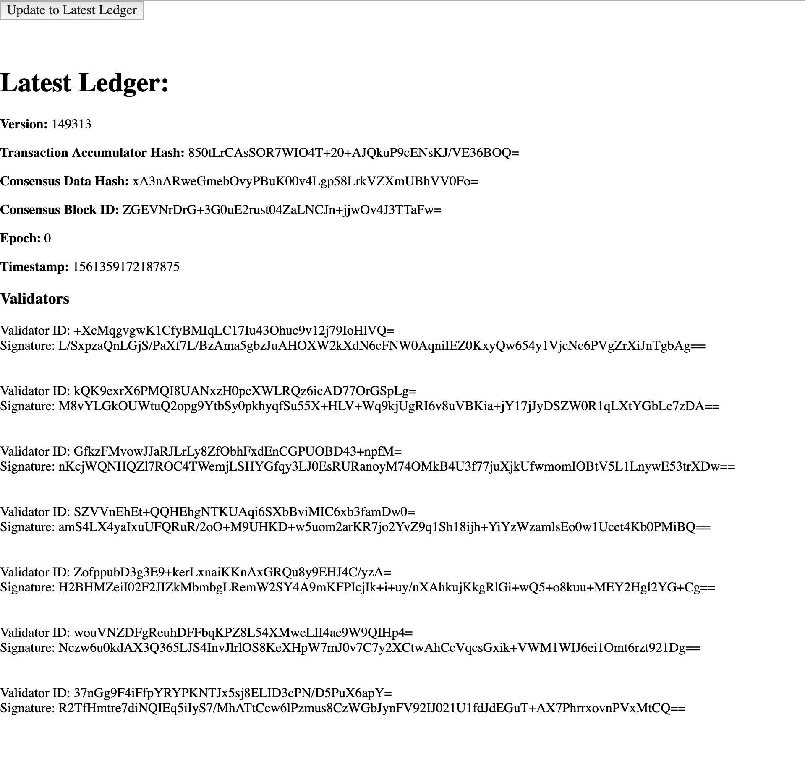

Excuse the mess!

## TODOs:

-   proper Readme
-   typescript or flow typing
-   full available grpc implementation w/ full REST api availability
-   transcribe npm scripts into .sh files for convenience
-   move some npm scripts to be handled by webpack
-   splitting code into individual modules and decoupling builds

## Sources

references from https://github.com/bonustrack/libra-grpc for basic npm grpc/protobuf code snippets and handling and guidance on how to use admission control and https://github.com/phlip9/libra_example for some bash scripting references. https://auth0.com/blog/node-js-and-express-tutorial-building-and-securing-restful-apis/#Building-and-Securing-RESTful-APIs for express / RESTful information and code snippets.

## Instructions

1. Install Libra: `git clone https://github.com/libra/libra.git && cd libra`
2. Set \$LIBRA environment variable to root libra project path
3. `npm run setup` will install node modules, find libra proto files, build js and flow files for them
4. `node src/main.js` will run a small client test with an empty update request.
5. `npm run start-server` starts the express server with the REST api w/ libra RPC. By default runs at localhost:3001 but can be changed in server/config.js.
6. Open dist/client/index.html to see a demo page hitting the endpoint.

run `npm run testnet` to quickly launch libra testnet cli as an unrelated convenience. There's a lot of other scripts too I guess.

## Notes

If the setup script doesn't work for you it might be because of a different `sed` implementation (https://unix.stackexchange.com/questions/36795/find-sed-search-and-replace), try replacing the `copy-protos` script with one that calls `sed` per your implementation.

https://github.com/libra/libra/blob/master/scripts/cli/start_cli_testnet.sh <-- current address for testnet `ac.testnet.libra.org:8000`

Example output of running main.js:

```
creating libra grpc client
client created
testing UpdateToLatestLedger
testing SendTransaction
Empty UpdateToLatestLedger call complete.
Parsing response..
{"responseItemsList":[],"ledgerInfoWithSigs":{"signaturesList":[{"validatorId":"SZVVnEhEt+QQHEhgNTKUAqi6SXbBviMIC6xb3famDw0=","signature":"hFGQS9LHhsHo8HVYVftll5Qn8hV9FoWpyB6UgCT//dx1ORyd6QP8oRq3ZnxhdK1Ebq1RBLQS4vT5COjPAJkJAA=="},{"validatorId":"ZofppubD3g3E9+kerLxnaiKKnAxGRQu8y9EHJ4C/yzA=","signature":"4ZarwbgOTh1y5DcQ/i6rIzhGJC+Kx0kF52PaTmNNXah5fr4dF8/EZvbHOeIUU4ODZNngZU/QX1UTojNYIGosAg=="},{"validatorId":"wouVNZDFgReuhDFFbqKPZ8L54XMweLII4ae9W9QIHp4=","signature":"52r/rGK+fOR6v2JkBdw/+mpK1ZWWfpWLf5ISVUW7aikDTrrh+Z582HRlYWJoVM1/Ax0eFrQl2L/KMcpZeCDaDw=="},{"validatorId":"Joc97NkzAGWYiwrPUCdmK1CX+1CROuKiZStQqYad9Ps=","signature":"v/qEtmP5eEH4/wW7M8whuCoGWalPEJd0NRplPve7+mV1hkp6AQNtf49d6AJB2dMfLSWojoaB+rmuQ319UOfUBg=="},{"validatorId":"+XcMqgvgwK1CfyBMIqLC17Iu43Ohuc9v12j79IoHlVQ=","signature":"GK5zdmJYYOvugtRYd41yJYeEz87wEEatHG1X50IAY6ByT7rI4QgKkz2JnSxhqID2xWYrUNVbP4eGbnYYrSupAQ=="},{"validatorId":"TXirkLdZ7Kyv5OaHxducwpNqeinISqi+d39U21GddWs=","signature":"apGvCZqfpd8QaKDVQKtHp4PX6Vco7tp0mpNsxQNwYLcUmnW6ZGnKHyV//sTemb+nZw4T43uQVuO6Gg1T1yKVCQ=="},{"validatorId":"GfkzFMvowJJaRJLrLy8ZfObhFxdEnCGPUOBD43+npfM=","signature":"mCMSsNOGffM7RUY2Dqa1oYVONKrh68OZRg0evHl8mLRkYIOl5oM8Gn+Vi8jMAxHW/bhS/0zkQ5Gw2vgF1OoyDw=="}],"ledgerInfo":{"version":144702,"transactionAccumulatorHash":"24TFyUYFn70nEhcuAReASSp2hHqNdBe8rXnT+7T2MA8=","consensusDataHash":"DFZF3UufXoRCzj7/34cPwLJ5Wj00d1OYHnti+Cq3XvI=","consensusBlockId":"SEKSIX+KHbu6YBFCJSm6AAbft3XdaBtOi7/u1+rzuSM=","epochNum":0,"timestampUsecs":1561345784903310}},"validatorChangeEventsList":[]}
```

Example of test site:


